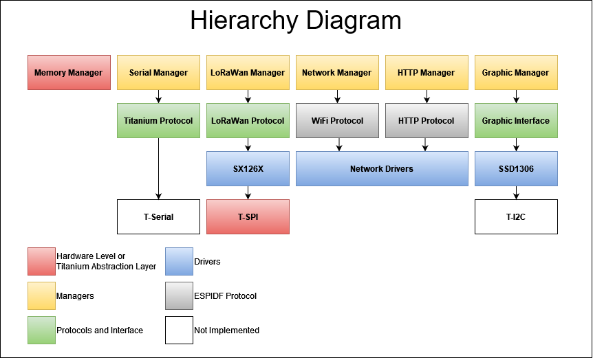

# Titaniumv2 - IoT Operating System for ESP32

Titaniumv2 is an open-source operating system designed to bring a Linux-like experience to IoT devices using the ESP32 IDF. Built on top of the ESP32 IoT Development Framework, this project aims to provide a robust and efficient environment for running applications on resource-constrained IoT hardware.

## Features

- **Task Management**: Titaniumv2 supports multitasking and efficient task scheduling, allowing IoT devices to run multiple applications concurrently.

- **Memory Optimization**: The operating system is designed to manage system memory efficiently, optimizing performance for IoT use cases.

- **Peripheral Access**: Titaniumv2 provides an abstraction layer for interacting with peripherals, making it easier to develop applications that use sensors, actuators, and other hardware components.

- **Networking**: Incorporate networking capabilities to facilitate communication between IoT devices, enabling seamless data exchange in IoT ecosystems.

- **File System**: Titaniumv2 includes a simplified file system abstraction tailored for IoT devices, making it convenient to read and write data to non-volatile storage.

## Installation

Follow these steps to set up Titaniumv2 on your ESP32 device:

1. Clone the Titaniumv2 repository:
   ```bash
   $ git clone https://github.com/LucasDFranchi/Titaniumv2.git
   $ cd Titaniumv2
   ```

2. Set up the ESP32 IDF toolchain and environment as per the [official ESP32 IDF documentation](https://docs.espressif.com/projects/esp-idf/).

3. Build and flash Titaniumv2 onto your ESP32 device:
   ```bash
   $ idf.py build
   $ idf.py -p /dev/ttyUSB0 flash
   ```
## Contributing

Contributions to Titaniumv2 are welcome! To contribute:

1. Fork the repository.
2. Create a new branch: `git checkout -b feature-name`
3. Make your changes and commit them: `git commit -m 'Add new feature'`
4. Push to the branch: `git push origin feature-name`
5. Open a pull request.

Please follow our [code of conduct](CODE_OF_CONDUCT.md) and ensure your changes adhere to our coding standards.

## License

This project is licensed under the [Creative Commons Attribution 4.0 International License](https://creativecommons.org/licenses/by/4.0/).

## Contact

For questions or support, feel free to reach out to us:
- Email: LucasD.Franchi@gmail.com

## Module Diagram



---
